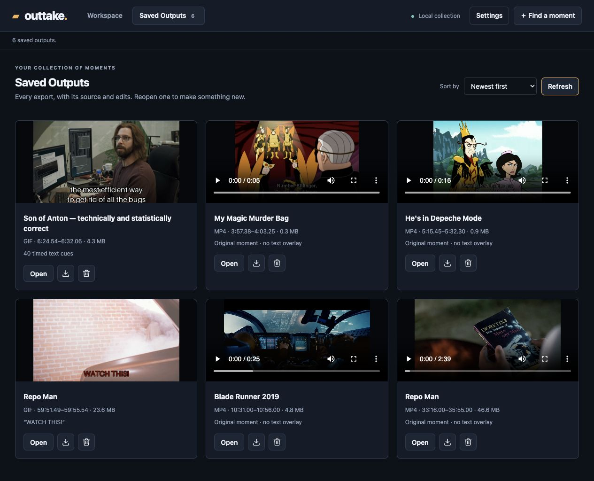

# Outtake

[Website source and preview instructions](site/README.md)

**Remember the moment. Make it yours.**



Outtake helps you and your agent find and shape moments from your own film and
television collection. Describe the scene you remember—a line, a gesture, a
reaction, or a famous cut—and turn it into a clip, GIF, or still without first
hunting down the timestamp.

Share a moment with friends, make a reaction GIF or image meme, or extract a
higher-quality clip for a film criticism video. Your agent can find, refine, and
export the result directly. When you want to take the controls, open the local
workspace to trim the selection, loop playback, add timed text, and choose an
output format.

## Quick start: bring a moment to your agent

Give your coding agent this message, replacing the example with your own memory:

> Use [Outtake](https://github.com/robotdad/amplifier-smart-tool-outtake) to find
> the exchange in Silicon Valley where Gilfoyle explains why Son of Anton deleted
> the code. Install Outtake, then read `outtake --help` for its usage skill and
> `outtake <command> --help` for each capability you need. Help me configure my
> video and output folders, find the
> whole exchange, and open it in the workspace so I can trim and export it.

Your agent installs and runs Outtake, helps resolve the title or episode, and
presents a proposed cut. You can ask for the finished output in conversation or
participate in the dashboard. No repository checkout is needed to use the tool.

### Before your first moment

Use a coding agent that can install and run local tools and, for the optional
workspace, open a browser. Outtake requires Python 3.12+, Git, uv, and FFmpeg with
FFprobe. Your video files must be locally accessible, including through a mounted
share. This is an early implementation, exercised on macOS.

Smart finding uses **Amplifier Agent** and needs its own configured model access.
Your coding agent’s model access is not automatically shared with Outtake. Ask your
agent to install the `smart` extra and configure OpenAI, Anthropic, Gemini, GitHub Copilot, or ChatGPT with
a suitable vision-capable model. API keys and Copilot tokens come from the tool
process’s environment; ChatGPT uses explicit device sign-in and Amplifier Agent’s
OAuth cache. The dashboard saves provider/model choices, not credentials.
See the [provider setup instructions](src/outtake/SMART_TOOL.md#smart-finding-disclosure-and-continuation).

You choose which folders Outtake may inspect and which evidence its provider may
see. Smart finding uses bounded requests, metadata, captions, and sampled frames
within that permission. It does not send raw video or audio. Explicit cuts,
previews, exports, and caption handling work locally without a model.

### For the agent receiving this link

Install the tool without cloning the repository:

```sh
uv tool install "outtake[smart] @ git+https://github.com/robotdad/amplifier-smart-tool-outtake"
outtake --help
```

`outtake --help` is the tool-owned usage skill. Read it first, then
`outtake <command> --help` for each capability’s skill, including request shapes,
examples, results, and recovery guidance. `outtake <command> -h` provides a short
flag reference.
[`AGENTS.md`](AGENTS.md#using-the-tool-for-a-person) describes the caller workflow.

## What the loop looks like

1. **Describe.** Start with a film or show and whatever you remember. Your agent
   can narrow a vague clue before asking Outtake to search.
2. **Find and review.** Captions and sampled source frames support proposed cuts.
   Review the evidence and uncertainty; a related frame is not proof of the whole event.
3. **Make it yours.** Trim with two handles, place the playhead precisely, and loop
   the selected range. Use source captions or add your own timed text and styling.
   Supported image subtitles can keep their original appearance or be converted
   to editable text with optional local Tesseract OCR.
4. **Export and return.** Choose MP4, GIF, or PNG with Mobile, Easy sharing, or
   Higher quality presets. Saved Outputs brings results together for download,
   reopening, and deletion. Revisions preserve earlier exports and original media.

The workspace supports light, dark, and system appearance, plus folder and model
settings. The same library powers the agent, CLI, and dashboard. Closing the browser
tab does not stop the dashboard server; ask your agent to stop it when finished.

## What to expect

Outtake currently edits one source at a time; it is not a full timeline editor.
Finding quality depends on the clues, available evidence, and model. Review the
proposed moment and its boundaries, especially sound: Outtake does not listen to
or automatically verify dialogue or nonverbal audio.

Sharing presets balance size and quality without guaranteeing a file size.
Higher quality is a re-encode, not a lossless editing master. Current media support
is SDR; HDR and rotated video are rejected explicitly. The browser’s live text is
a draft; **Preview edits** renders the actual output for review.

The image above is a real Saved Outputs screenshot, not a mockup. The
[vision](docs/VISION.md) and [contracts](contracts/agent-tool.v1.md) remain drafts;
[implementation notes](docs/IMPLEMENTATION.md) record shipped behavior, checks,
and remaining limits.

## Developing or contributing?

An optional host-neutral MCP adapter and portable review App let a person and agent
work on the same explicitly authorized retained moment. The base CLI and native
dashboard remain independent of MCP. See [portable review setup and limits](docs/MCP.md)
for optional installation, configuration, the capability matrix, and reproducible tests.

Clone the repository when you want to work on Outtake itself.
[`AGENTS.md`](AGENTS.md#develop-from-this-checkout) covers setup, tests, architecture,
and the contribution workflow.

## Go deeper

- [Agent usage and development workflow](AGENTS.md)
- [Library and CLI reference, installation, and provider setup](src/outtake/SMART_TOOL.md)
- [Vision](docs/VISION.md)
- [Agent/tool contract](contracts/agent-tool.v1.md) and [caller interaction contract](contracts/caller-interaction.v1.md)
- [Implementation and verification status](docs/IMPLEMENTATION.md)
